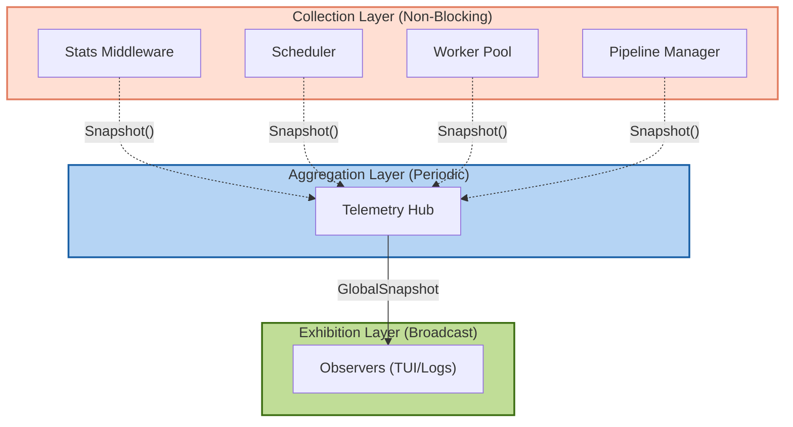

GoScrapy's telemetry system uses a decoupled, three-layer architecture to enable high-performance metric collection without blocking the crawler's hot-path.

## Architecture Overview



### Component Roles

**1. `TelemetryHub` (The Conductor)**
The Hub is the central engine of the telemetry system. It runs in its own background goroutine and uses a simple timer (ticker) that wakes up at a fixed interval (default: 500ms). When it wakes up, it quietly asks all registered Collectors for their latest data, packages that data into a single `GlobalSnapshot`, and sends it to all Observers. Because it runs independently, it never slows down your actual scraping tasks.

**2. `IStatsCollector` (The Sensors)**
Collectors are the components doing the actual work (like Middlewares, Pipelines, or the Engine itself) that also secretly gather metrics on the side. For example, a collector might count how many HTTP requests were made or how many items were saved to a database. When the Hub asks for data, the Collector instantly returns a read-only copy (`ComponentSnapshot`) of its current numbers.

**3. `IStatsObserver` (The Display / Exporter)**
Observers are the consumers of the data. They sit and wait for the Hub to hand them a `GlobalSnapshot` every 500ms. An Observer could be a Terminal UI (like the TUI dashboard) that updates progress bars, a JSON Logger that prints to the console, or an exporter that pushes the metrics to an external service like Prometheus or Datadog. Observers receive data passively—they don't have to ask for it.

**4. `GlobalSnapshot` (The Payload)**
This is the package of data that the Hub creates and hands to the Observers. It is completely read-only, meaning Observers can safely read it without worrying about race conditions. It contains:
- `Timestamp`: The exact time the snapshot was taken.
- `Uptime`: How long the spider has been running.
- `Components`: A map containing the individual `ComponentSnapshot` payloads from every registered Collector.

```json
{
  "Timestamp": "2026-07-23T20:10:07+05:30",
  "Uptime": 120500000000,
  "Interval": 500000000,
  "Components": {
    "HttpStats": {
      "RequestsSent": 150,
      "ResponsesReceived": 145
    },
    "DatabasePipeline": {
      "SavedItems": 140
    }
  }
}
```

---

## 1. Creating a Custom Collector

A Collector is responsible for gathering metrics during execution. It must implement `IStatsCollector`, which requires two methods:

1. `Name() string`: Identifies the component in the GlobalSnapshot.
2. `Snapshot() ts.ComponentSnapshot`: Returns the current metrics state safely.

Here is an example of a **Custom Item Pipeline** that also acts as a Collector. It counts how many items are successfully saved.

```go pipeline.go expandable
package my_spider

import (
    "sync/atomic"
    "github.com/tech-engine/goscrapy/pkg/core"
    "github.com/tech-engine/goscrapy/pkg/engine"
    ts "github.com/tech-engine/goscrapy/pkg/telemetry/stats"
)

// 1. Define your metrics payload
type ItemStats struct {
    SavedItems uint64
}

// 2. Create the component that implements IStatsCollector
type MetricsPipeline struct {
    savedCount atomic.Uint64
}

// Satisfy IPipeline: Process an item and increment the counter safely
func (p *MetricsPipeline) ProcessItem(pi engine.IPipelineItem, out core.IOutput[*Record]) error {
    record := pi.GetItem().(*Record)
    
    // ... logic to save record to Database ...

    p.savedCount.Add(1)

    return nil
}

// Implement IStatsCollector: Provide a name
func (p *MetricsPipeline) Name() string {
    return "DatabasePipeline"
}

// Implement IStatsCollector: Return a safe snapshot of the metrics
func (p *MetricsPipeline) Snapshot() ts.ComponentSnapshot {
    return ItemStats{
        SavedItems: p.savedCount.Load(),
    }
}

// Pipeline boilerplate
func (p *MetricsPipeline) Open(ctx context.Context) error { return nil }
func (p *MetricsPipeline) Close() {}
```

---

## 2. Creating a Custom Observer

An Observer listens for updates. It must implement `IStatsObserver`, requiring one method:

1. `OnSnapshot(snap ts.GlobalSnapshot)`: Receives the latest metrics. This function **must not block**, otherwise it will slow down the Hub.

Here is a simple **Generic JSON Logger** that receives the metrics and logs them as JSON.

```go logger.go expandable
package my_spider

import (
    "encoding/json"
    "fmt"
    ts "github.com/tech-engine/goscrapy/pkg/telemetry/stats"
)

// Create the component that implements IStatsObserver
type JsonLoggerObserver struct {}

// Receives the broadcast every interval (e.g. 500ms)
func (j *JsonLoggerObserver) OnSnapshot(snap ts.GlobalSnapshot) {
    // 1. Extract our specific collector's payload by Name
    if compSnap, exists := snap.Components["DatabasePipeline"]; exists {
        
        // 2. Type-cast back to our struct
        if stats, ok := compSnap.(ItemStats); ok {
            
            // 3. Format as JSON
            data := map[string]interface{}{
                "timestamp":   snap.Timestamp.Format("2006-01-02T15:04:05Z07:00"),
                "uptime_sec":  snap.Uptime.Seconds(),
                "saved_items": stats.SavedItems,
            }
            
            jsonBytes, _ := json.Marshal(data)
            fmt.Println(string(jsonBytes))
        }
    }
}
```

---

## 3. Wiring It Together

Now we inject both our Custom Pipeline (Collector) and JSON Logger (Observer) into the engine during startup.

```go base.go expandable
func New(ctx context.Context) (*Spider, error) {
    app, err := gos.New[*Record]()
    if err != nil {
        return nil, err
    }

    // Initialize our components
    dbPipeline := &MetricsPipeline{}
    jsonLogger := &JsonLoggerObserver{}

    // 1. Setup the Telemetry Hub
    hub := ts.NewTelemetryHub(nil) // nil uses default 500ms interval
    
    // 2. Register the Collector
    hub.AddCollector(dbPipeline)
    
    // 3. Register the Observer
    hub.AddObserver(jsonLogger)

    // 4. Attach the Pipeline and Hub to the Engine
    app.WithPipelines(dbPipeline).
        WithTelemetry(hub, nil)

    spider := &Spider{ICoreSpider: app}
    app.RegisterSpider(spider)

    return spider, nil
}
```