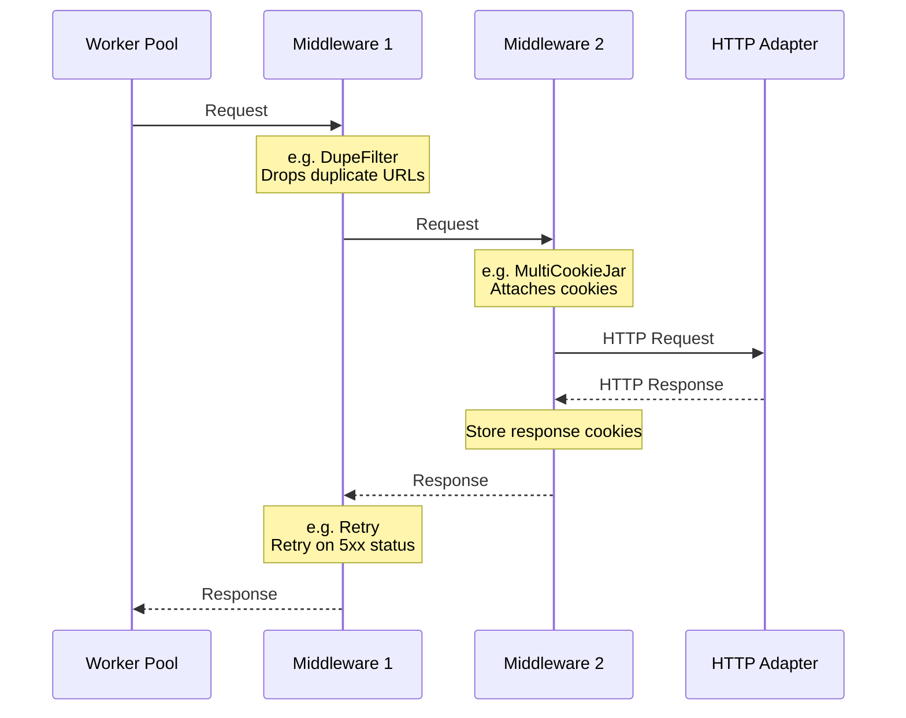

Middlewares intercept the HTTP request/response lifecycle. They sit between the Worker Pool and the HTTP Adapter, giving you hooks to modify requests before they are sent and responses before they reach your spider.

## Request-Response Lifecycle

<Note>
  Middlewares are executed in **reverse order** from bottom to top as listed in `settings.go`. The last middleware in the list is the closest to the HTTP Adapter.
</Note>

## Common Use Cases

- **Retry failed requests** with exponential backoff.
- **Filter duplicate URLs** to avoid redundant work.
- **Manage cookies** across requests using named sessions.
- **Spoof TLS fingerprints** to bypass advanced bot detection.
- **Collect telemetry** and metrics on request/response performance.