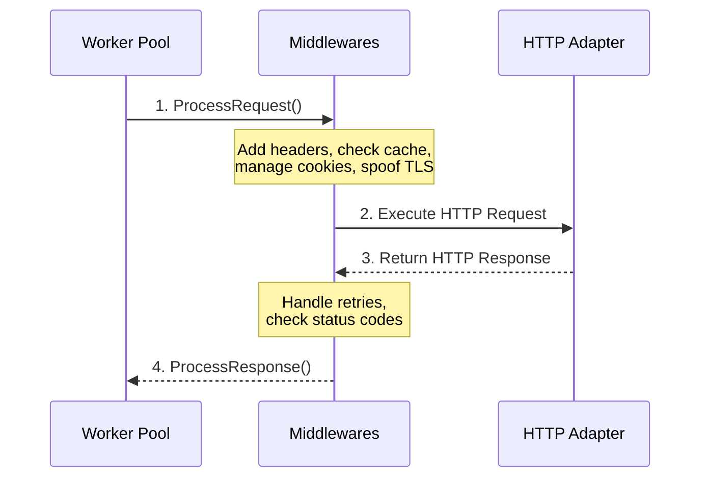

Middlewares provide a way to inject custom logic into the request/response lifecycle. They sit right between the Worker Pool (execution layer) and the HTTP Adapter (network layer).

Middlewares can:

- Modify a request before it is sent (e.g., add headers, manage cookies, or spoof TLS).
- Process a response before it reaches your spider (e.g., handle retries, check status codes).
- Track telemetry and metrics.